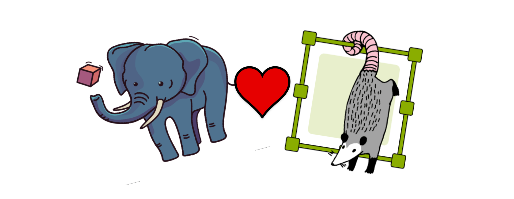
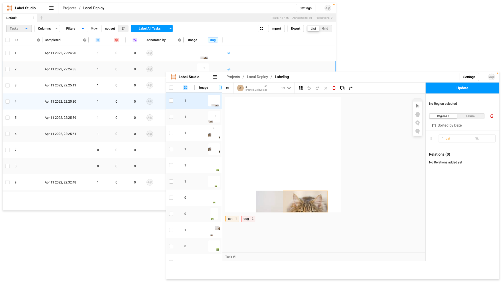

# Strengthening The Alliance 



In the Modern Software Engineeing Branch at Georgia Tech Research Institute (GTRI) we are utilizing [Pachyderm](https://www.pachyderm.com) and [Label Studio](https://labelstud.io), both part of the [AI Infrastructure Alliance](https://ai-infrastructure.org), to create an MLOps pipeline able to support Active Learning. 
We have started working with these tools based on their applicability to our situation, but also because of the incentive they have in working together as part of the AI Infrastructure Alliance. 
A coalition of companies banded together with the goal of becoming the canonical stack of AI and ML.
It’s immediately apparent that these companies are working together to create great products.
Jump into the Label Studio slack channel and ask about the connection infrastructure between the two (will talk about this not a little later) and immediately see that a Pachyderm person is helping you in the Label Studio thread! 
In this post I’ll give you a short walkthrough of how we are helping the alliance by enhancing the cloud connection capability between Pachyderm and Label Studio, first though, let’s look at the missing piece!

## Labelling Data
I am going to do some skipping to the important parts, but if you want to use Label Studio follow the instructions for downloading and getting started here: [Label Studio Quick-Start](https://labelstud.io/guide/index.html#Quick-start)



If you followed the instructions in the link you’ll be familiar with projects, like the one shown in the figure above, and understand at least some of how to annotate each “task”.
Now one big difference between the tutorial and what we are doing is how we invest our data. 
In most cases folks are likely taking local data and uploading it into the local instance of Label Studio.
A little foreshadowing, Label Studio has a JSON format that they store your annotations in, and in order to support the framework you are using you will need to convert or “export” the data with the appropriate format. 
If you are using the local tool this is as easy as clicking the export button, choosing the needed format and downloading the data to your machine.

## Getting Data from A to B

First, if you want to get started with Pachyderm, follow this link, [Getting Started](https://docs.pachyderm.com/latest/getting_started/), for a local deployment using [minikube](https://minikube.sigs.k8s.io/docs/). [Connecting Label Studio and Pachyderm](https://github.com/pachyderm/examples/tree/master/label-studio) is more involved, and out scope for this post, for that I suggest jumping into the Pachyderm slack channel and getting help on setting everything up!

For us, we need to import data from Pachyderm, label it, and then have it exported to Pachyderm, ideally in the proper format. 
Which brings us right up to our problem!

The linking between Label Studio and Pachyderm is "cloud" based, with Label Studio treating a Pachyderm repo as an S3 bucket and retrieving data from it. 
Likewise for exporting, the data is simply synced up with a different Pachyderm repo. 
Once connected to pachyderm, a manual sync results in the Label Studio formatted JSON file being passed to our output repo. 
So, once we get that JSON file into our Pachyderm repo we need an easy way to convert that into the annotations we need!
And we have created a tool for this exact purpose.

## The Solution

While Label Studio does have some [export solutions written in python](https://github.com/heartexlabs/label-studio-converter), I have found that they are a little unwieldy especially compared to the provided [API](https://labelstud.io/api). 
Even the API can be a pain to understand, and most probably don't want to deal with it at all.
So, we created a simple python CLI tool and baked it into a container for immediate Pachyderm pipeline support. _It can also be used for convience as a python package or just in the provided container_
This tool uses API commands to convert the annotations for the completed "tasks" and download them using the necessary method (some need to be unzipped) to be ready for training. 
You can find the source code on our [GitHub](https://github.com/rutheferd/daffy), and pull the container with the command below, _I use [podman](https://podman.io) but feel free to use [docker](https://www.docker.com) as well_:

```
podman pull ghcr.io/rutheferd daffy:6bec1b9db3d11b1d4bde93c248ce548e0fe8589e
```
For Pachyderm you can use the provided daffy.json pipeline config [here](https://github.com/rutheferd/daffy/blob/develop/daffy.json), making sure to update the following as marked in the code block below: 

- **secret:** You will need to [create a secret](https://docs.pachyderm.com/latest/how-tos/advanced-data-operations/secrets/#create-a-secret) 
- **label studio hostname:** `localhost:8080`
- **label studio auth token:** [Find your Label Studio authentication token](https://labelstud.io/api#section/Authentication/Token)
- **project number:** Found in the URL of an open Label Studio project or by using the daffy details command.
- desired format: [Formats and Descriptions](https://github.com/rutheferd/daffy/blob/develop/formats.json)
- **input repo:** This repo will act as a trigger for this pipeline once a user runs a sync from Label Studio, _Note: This should be set as the output repo for Label Studio_

```json
{
    "pipeline": {
        "name": "Label_Converter"
    },
    "description": "A pipeline that downloads and converts data from Label Studio.",
    "transform": {
        "image_pull_secrets": [
            "[secret]"
        ],
        "cmd": [
            "sh"
        ],
        "stdin": [
            "daffy export -h [label studio hostname] -t [label studio auth token] -p [project number] -e [desired format] -o /pfs/out"
        ],
        "image": "ghcr.io/rutheferd/daffy:584f6818ca426b76a42c9b5a50d535db14853417"
    },
    "input": {
        "pfs": {
            "glob": "/",
            "repo": "[input repo]"
        }
    }
}
```

Now that you have a proper pipeline config you will just need to run the following command from your terminal:

```
pachctl create pipeline -f daffy.json
```

Congrats! You pipeline is now able to provide the proper annotation format for your data. Now that this is all done, and assuming you have made the correct connections to input/output repos inside of Label Studio, each time a user syncs data this pipeline will trigger and download the completed tasks in the selected annotation format. You can now connect the output repo of this pipeline to you training pipeline and get to model cookin'!

## Additional Daffy Information

Check out the [Readme](https://github.com/rutheferd/daffy/blob/develop/README.md) for the most up to date usage instructions.
